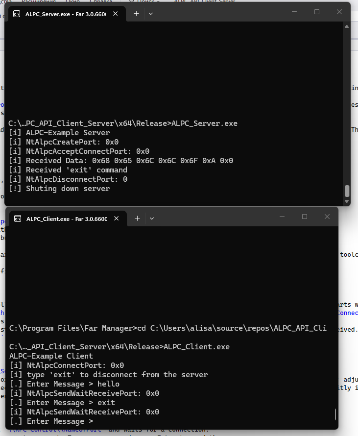

# ALPC WINAPI Client and Server (NtAlpc**)

## Overview

This small project demonstrates inter-process communication on Windows using the Advanced Local Procedure Call (ALPC) native APIs (NtAlpc*). It contains two example programs:

- `ALPC_Server.c` — creates an ALPC port at `\RPC Control\NameOfPort`, accepts a client connection, receives messages, prints the raw bytes of each message, and listens for an `exit` command to shut down.
- `ALPC_Client.c` — connects to the same ALPC port and sends user-entered text messages to the server.

Both examples call functions from `ntdll.dll` and include an `ntalpcapi.h` header (project-local) that declares the necessary native API prototypes. The code demonstrates the required message layout (a `PORT_MESSAGE` header followed by the user data) and basic use of `NtAlpcCreatePort`, `NtAlpcAcceptConnectPort`, `NtAlpcConnectPort`, and `NtAlpcSendWaitReceivePort`.

## Files

- `ALPC_Server/ALPC_Server.c` — Server implementation
  - Creates the ALPC port with `NtAlpcCreatePort`.
  - Waits for a connect request, accepts the connection, and loops receiving messages with `NtAlpcSendWaitReceivePort`.
  - Prints each received byte in hex and checks for the exact string `"exit\n"` to tear down the connection.
  - Uses `HeapAlloc` to allocate message buffers that combine a `PORT_MESSAGE` header and payload.

- `ALPC_Client/ALPC_Client.c` — Client implementation
  - Connects to `\\RPC Control\\NameOfPort` using `NtAlpcConnectPort`.
  - Reads user input with `fgets`, wraps it together with a `PORT_MESSAGE` header, and sends it with `NtAlpcSendWaitReceivePort`.
  - The program demonstrates how to format the message buffer so the native ALPC functions can parse it.

- `ntalpcapi.h` (referenced) — expected to provide declarations for the native ALPC functions and any necessary structures if not provided by the toolchain.

- `ALPC_Server.vcxproj.filters` — Visual Studio filter file grouping the server source in the solution explorer.

## How it works (important details)

- ALPC messages must be laid out as a `PORT_MESSAGE` followed immediately by the message payload. The examples allocate contiguous memory that starts with a `PORT_MESSAGE` and follows with the payload bytes.
- The server sets `ALPC_PORT_ATTRIBUTES.MaxMessageLength` (example uses 0x500 / 64KB maximum for ALPC) and accepts connections with `NtAlpcAcceptConnectPort`.
- The client connects using `NtAlpcConnectPort` and uses `NtAlpcSendWaitReceivePort` to send and optionally wait for replies.
- The server code compares the received payload to the string `"exit\n"` (note the newline from `fgets`) and disconnects when that command is received.
- Both files include `#pragma comment(lib, "ntdll.lib")` — linking `ntdll.lib` is required if prototypes are declared manually.

## Build instructions (Visual Studio 2022)

1. Open or create a project/solution and add the `ALPC_Server` and `ALPC_Client` C files and the `ntalpcapi.h` header to the include path.
2. Ensure the project is configured to compile C code (or C++ if you adapt the code). If using Visual Studio defaults, the code will compile as C; adjust if necessary.
3. Make sure the project links to `ntdll.lib`. Either keep the `#pragma comment(lib, "ntdll.lib")` lines in the sources or add the library explicitly in __Project Properties > Linker > Input__ (add `ntdll.lib`).
4. Build for the target architecture that matches your environment (32-bit vs 64-bit). Both client and server must use the same pointer width.

## Run

1. Launch the server first. It creates the ALPC port at `\\RPC Control\\NameOfPort` and waits for a connection.
2. Launch the client. It will connect to that port and present a prompt. Type messages and press Enter to send them.
3. To stop the server, type `exit` (the client sends `"exit\n"` and the server compares against that string).

## Limitations and security considerations

- These examples use undocumented/native NT APIs. Behavior may differ across Windows versions and is not officially supported for production.
- No authentication, access control, or input sanitization is implemented. Do not expose these endpoints in production or on systems with untrusted users.
- Message sizes and boundaries are handled naively — care is required if adapting for binary protocols or large payloads.
- The code assumes little-endian architecture and ASCII/ANSI textual payloads.

## Recommendations

- If you plan to use ALPC in real code, prefer documented RPC/ALPC wrappers or implement robust framing, error handling, and access checks.
- Keep client and server compiled for the same architecture (x86 vs x64).
- Add proper prototypes for the native APIs in `ntalpcapi.h` or use an accepted public header set that exposes the needed symbols.

